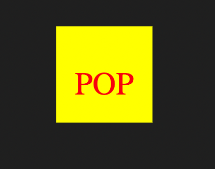
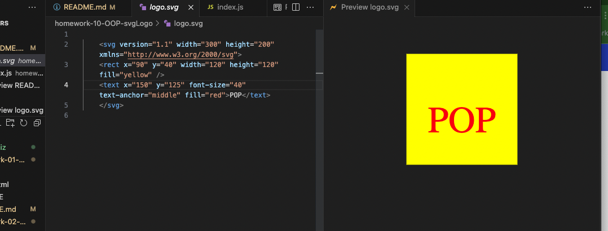

# homework-10-OOP-svgLogo

OOP Challenge - SVG Logo generator

Git Hub: https://github.com/minutemin/homework-10-OOP-svgLogo

Video Link: https://drive.google.com/file/d/1Puyc57ob9nkPUiaYJproHJqUurhHgO0m/view

## Badges
  

## Table of Contents (Optional)

- [Description](#description)
- [Installation](#installation)
- [Usage](#usage)
- [License](#license)

## Description

In this homework assignment, we were given a challenge to create a svg logo thru node using object oriented programming.  First, I created a repo in github and cloned it to my computer.  With node already installed, I initialized npm ('npm init')and installed inquirer v8.2.4 and jest. From here I open this in vscode.  I created a js file called Shape to store the class for a Shape constructor that sets the color that the user inputs.  Each shape (circle, square and triangle) were made into separate js files where they will required the Shape file and extend the Shape class.  I created test files for each of the shape as well and when you run 'npm run test', all 3 tests pass.  

Next, run 'node index.js' and the first question will be prompt.  There are 4 questions asked, 1. To enter 3 characters, 2. What is the color of the text, 3. What the shape it between circle, square and triangle, and 4. what color the shape is.  After all the questions are answered, there will be a file appear called 'logo.svg' which will contain the code of the svg logo!   

## Installation

To use this application, install npm ('npm i'). 

## Usage

 Next, run the tests by entering in the CLI 'npm run test'.  The tests should show that the 3 pass.  Next, run 'node index.js'.  This should prompt the first question, to enter 3 text characters for the logo. If the amoune is less or more than 3, there will be a prompt that says there must be 3.  It will then ask you what text color, shape and shape color you want to use fo the logo. Once all the questions are answered, a file 'logo.svg' will appear with the code of the logo! 

## License

[MIT - Terms and Conditions](https://choosealicense.com/licenses/MIT/)
---

